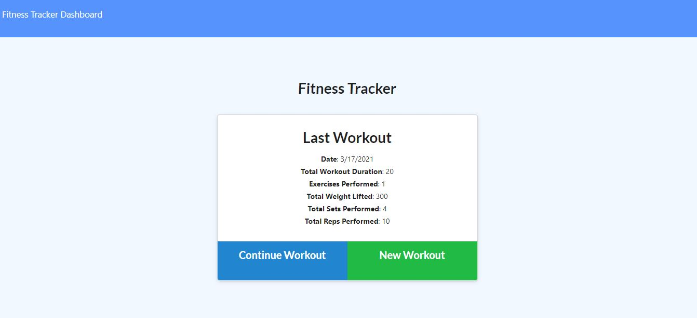

# Track Your Workouts

## Table of Contents
- [Description](#description)
- [Display](#display)
- [Installation](#installation)
- [Usage](#usage)
- [Contributing](#contributing)
- [Tests](#tests)
- [Questions](#questions)

## Display

 

## Description

As a user, you will have the ability to view, create, and track daily workouts. On this app you can log multiple exercises in a workout on a given day. Also, able to track the name, type, weight, sets, reps, and duration of exercise. If the exercise is a cardio exercise, you can record the distance traveled.

## Installation
For link to Heroku Web Application click [https://trackyoworkout.herokuapp.com/]()

## Usage
npm install mongo, morgan, and express. Run seed.js to give you starter database.

## Contributing
Have an ideas how to make improvements please feel free to fork or comment!

## Tests
NodeJS

## Questions
GitHub: @kmsaunders7
email: kmsaunders7@gmail.com
